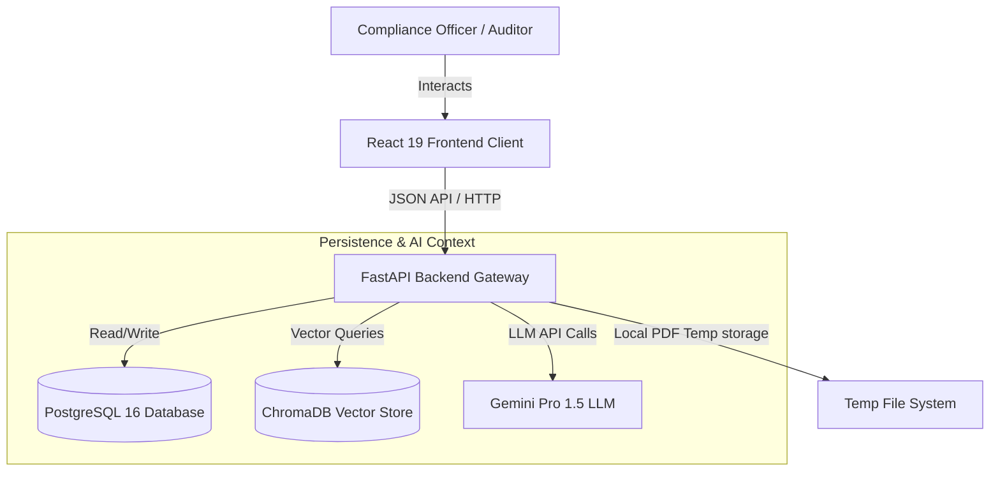
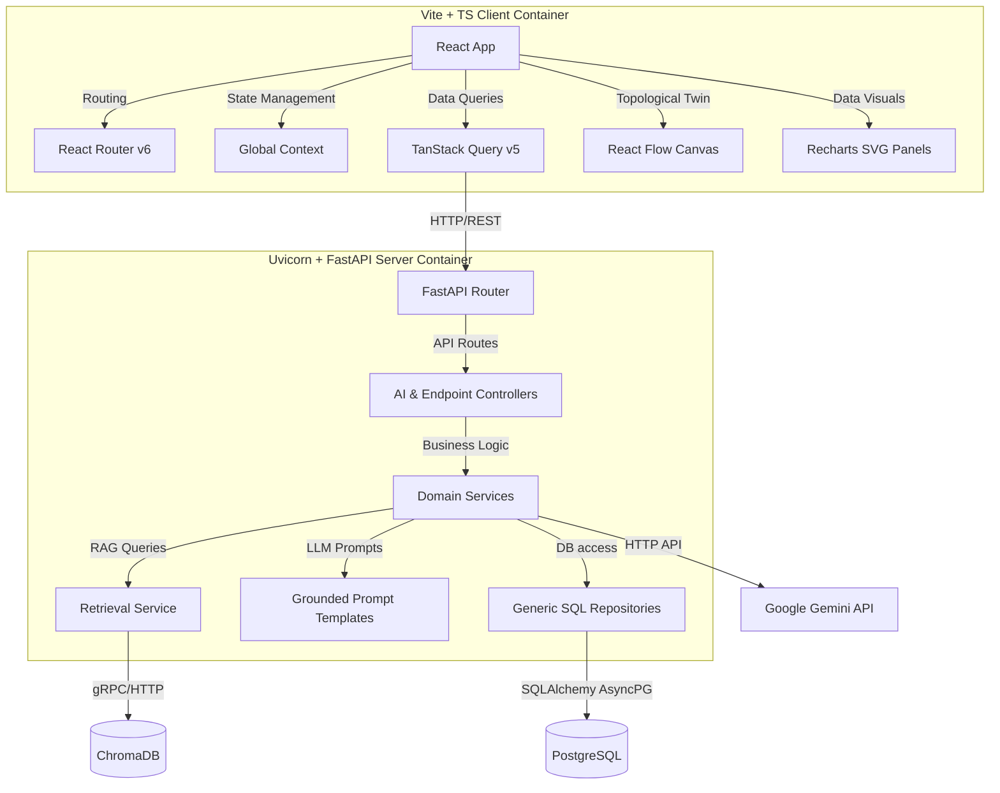
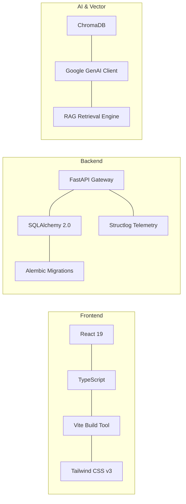
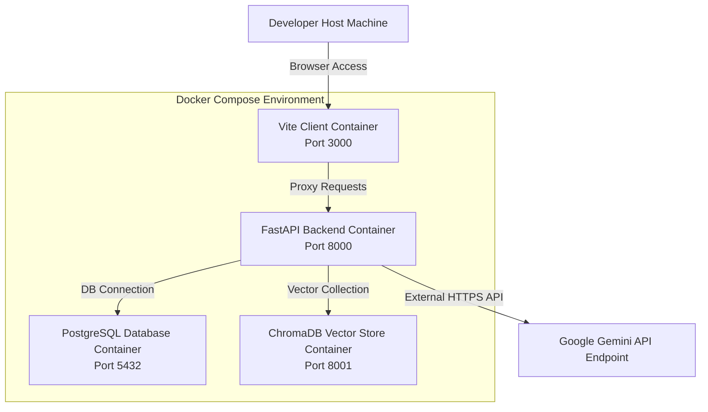
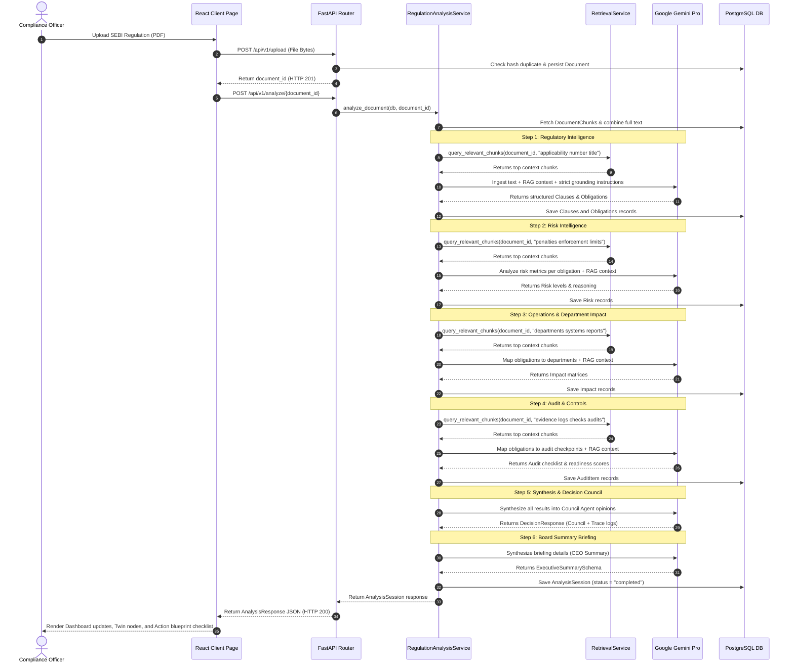
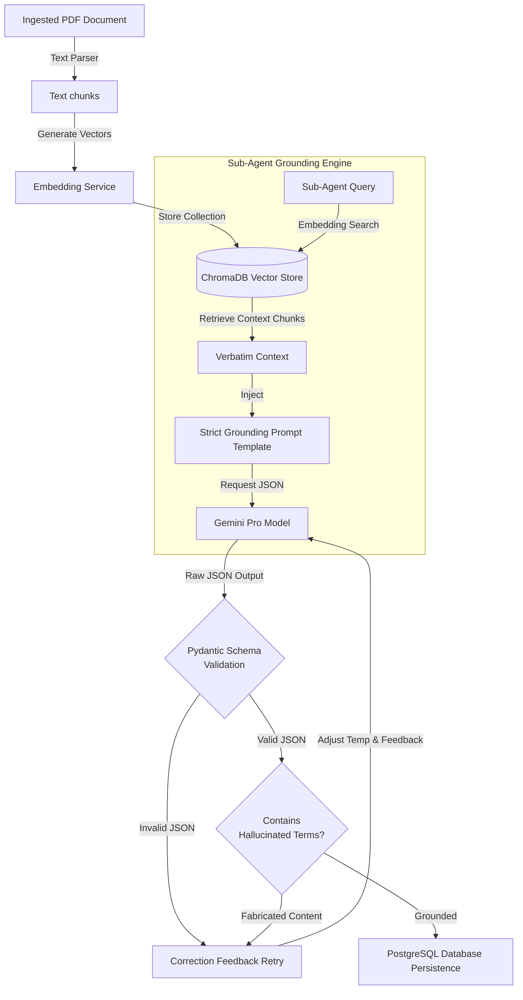
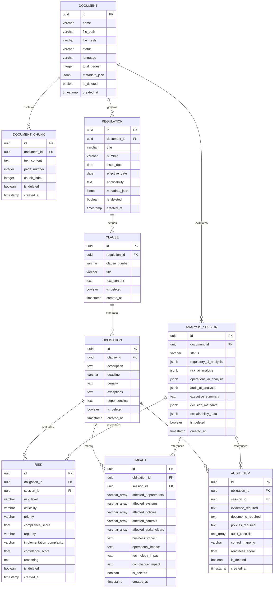
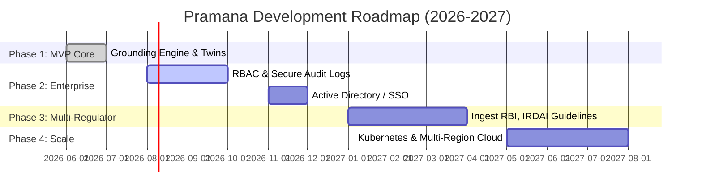

# PRAMANA — Regulatory Intelligence Platform
> Transforming Regulatory Knowledge into Trusted Action.

---

## 🏛️ Hero Section

<div align="center">
  
  <h1>PRAMANA</h1>
  <p><strong>Transforming Complex Regulatory Circulars into Explainable, Auditable, and Grounded Compliance Twins</strong></p>

  <p>
    <a href="https://github.com/Anugrahbhuinya/Pramana/blob/main/LICENSE"></a>
    <a href="https://python.org"></a>
    <a href="https://react.dev"></a>
    <a href="https://github.com/Anugrahbhuinya/Pramana/actions"></a>
    <a href="https://github.com/Anugrahbhuinya/Pramana/commits/main"></a>
    <a href="https://sebi.gov.in"></a>
  </p>
</div>

Pramana is an enterprise-grade AI-powered Regulatory Intelligence Platform. Built specifically for the **SEBI Securities Market TechSprint 2026**, Pramana ingests complex regulatory circulars and documents, processes them using strict grounding rules via a self-correcting Retrieval-Augmented Generation (RAG) pipeline, and constructs interactive compliance twins. These twins link regulatory legal obligations directly to verified internal control points, operations workloads, risk indexes, and ledger audits.

---

## 📖 Table of Contents

- [🏛️ Hero Section](#️-hero-section)
- [🎯 Problem Statement](#-problem-statement)
- [💡 Solution Overview](#-solution-overview)
- [✨ Product Features](#-product-features)
- [🏗️ High-Level Design (HLD)](#️-high-level-design-hld)
  - [System Context Diagram](#system-context-diagram)
  - [Container Diagram](#container-diagram)
  - [Technology Stack Diagram](#technology-stack-diagram)
  - [Deployment Diagram](#deployment-diagram)
- [📐 Low-Level Design (LLD)](#-low-level-design-lld)
  - [Decoupled Monorepo Structure](#decoupled-monorepo-structure)
  - [Request-Response Lifecycle](#request-response-lifecycle)
- [🤖 AI & Grounding Architecture](#-ai--grounding-architecture)
  - [The RAG Reasoning Pipeline](#the-rag-reasoning-pipeline)
  - [Confidence Score Formulation](#confidence-score-formulation)
  - [Self-Correcting LLM Validation Retries](#self-correcting-llm-validation-retries)
- [🔄 Application Sequence Flow](#-application-sequence-flow)
- [🔌 API Documentation](#-api-documentation)
- [🗄️ Database Design](#️-database-design)
  - [Entity-Relationship Diagram](#entity-relationship-diagram)
  - [Database Strategy](#database-strategy)
- [📂 Directory Layout & Modular Responsibilities](#-directory-layout--modular-responsibilities)
- [🚀 Installation & Launch Guide](#-installation--launch-guide)
- [⚙️ Configuration Reference](#️-configuration-reference)
- [🛡️ Security Architecture](#️-security-architecture)
- [⚡ Performance Optimization](#-performance-optimization)
- [🧪 Testing & QA Validation](#-testing--qa-validation)
- [🔮 Future Roadmap](#-future-roadmap)
- [🤝 Contributing & Git Standards](#-contributing--git-standards)
- [📜 Coding Standards](#-coding-standards)
- [📝 License](#-license)
- [🙏 Acknowledgements](#-acknowledgements)
- [📖 Appendix & Glossary](#-appendix--glossary)

---

## 🎯 Problem Statement

Modern financial institutions struggle to stay compliant with rapid, complex regulatory changes. Organizations face major operational vulnerabilities due to manual procedures and legacy architectures:

*   **Fragmented Intake**: Regulatory updates (e.g. SEBI circulars, RBI guidelines) arrive as unstructured PDFs with complex, dense legalese. Compliance teams must read and extract compliance clauses manually.
*   **The Hallucination Gap**: Generic AI models often fabricate requirements, invent regulatory numbers, or hallucinately assume non-existent compliance penalties, leading to legal and financial exposure.
*   **Disconnected Lineage**: There is no traceable link between an raw regulatory text and the actual operational controls in an organization's Risk Management Systems (RMS) or back-office ledgers.
*   **Audit Deficiencies**: Auditors struggle to verify compliance logs because evidence requirements are not mapped explicitly back to the original sections of the governing circular.

---

## 💡 Solution Overview

Pramana solves these challenges by combining strict **Semantic Grounding** with an interactive **Regulatory Digital Twin** ecosystem:

1.  **AI Grounding Engine**: Sub-agents evaluate compliance conditions using strict document-grounding instructions and hybrid keyword-vector retrieval. Hallucinations are actively neutralized; if a compliance topic is not present in the uploaded document, Pramana returns a standard fallback indicator: *"This information is not explicitly detailed in the provided circular."*
2.  **Compliance Twins**: Translates SEBI mandates into directed graph structures mapping regulatory clauses to control nodes.
3.  **Auditable Traces**: Maintains a 6-stage linear decision chain: *Source Clause* ➔ *Verbatim Context* ➔ *AI Reasoning* ➔ *Actionable Remediations* ➔ *Required Audit Evidence* ➔ *Department Owner*.

---

## ✨ Product Features

### 💻 Compliance Control Center
A comprehensive management dashboard presenting real-time compliance posture metrics, critical risk exposure counters, pending operational obligations, historical readiness trends, and recent analysis sessions.

### 📥 Regulation Ingestion
An interactive drag-and-drop workspace uploading SEBI circular PDFs. During ingestion, a multi-stage loading pipeline animates execution progress (*Reading Regulation ➔ Extracting Clauses ➔ Understanding Obligations ➔ Mapping Departments ➔ Assessing Risk ➔ Generating Controls ➔ Preparing Blueprint ➔ Consensus Complete*).

### 👥 AI Intelligence Council
A consensus-seeking engine simulating four distinct domain specialists that review the ingested regulation:
*   **Regulatory AI**: Analyzes regulatory applicability and legal scope.
*   **Risk AI**: Evaluates risk exposure levels, penalties, and implementation complexity.
*   **Operations AI**: Identifies impacted departments, systems, and ledger policies.
*   **Audit AI**: Establishes checklist checklists and required logs.

### 🕸️ Regulatory Digital Twin
An interactive **React Flow** network graph mapping SEBI clauses directly to corporate controls. Nodes can be clicked to open a detailed inspection sidebar detailing verbatim source text, technology impacts, and compliance actions.

### 📋 Execution Blueprint
A parameterized action-item checklist with text filters, department classifications, urgency/priority categories, and detail drawers to manage remediation workflows.

### 🔍 Decision Traceability
A timeline trace demonstrating the exact semantic proof chain linking recommended business actions back to the raw source text in the governing PDF.

### 📊 Report Generation
Fully-styled, print-ready PDF summaries (Executive Briefings, Action Blueprints, Traceability Journeys) exportable directly from the client application.

---

## 🏗️ High-Level Design (HLD)

Pramana uses a decoupled Clean Architecture monorepo design, separating the React client application, FastAPI backend server, PostgreSQL database, and ChromaDB vector store.

### System Context Diagram



### Container Diagram



### Technology Stack Diagram



### Deployment Diagram



---

## 📐 Low-Level Design (LLD)

### Decoupled Monorepo Structure

Pramana is structured as a single monorepo split into two isolated modules (`backend` and `frontend`), each containerized independently:

*   **Frontend**: Implements a **Feature-First Architecture**. View templates, state hooks, and API integrations are grouped inside folder containers under `src/features/` rather than dispersed across multiple directory layers.
*   **Backend**: Follows **Clean Domain-Driven Design**. The API layer only handles HTTP requests, delegating all coordination to the Service Layer. Data storage operations use a Generic Repository pattern with SQLAlchemy models, keeping the database engine decoupled from business logic.

```mermaid
classDiagram
    class RegulationAnalysisService {
        +analyze_document(db, document_id) AnalysisSession
    }
    class DocumentService {
        +process_and_save_document(db, file_name, file_bytes, file_path) Document
        +calculate_hash(file_bytes) str
        +is_duplicate(db, file_hash) tuple
    }
    class RetrievalService {
        +insert_chunks(document_id, chunk_ids, texts, embeddings, metadatas) void
        +query_relevant_chunks(document_id, query_text, limit) list
    }
    class EmbeddingService {
        +get_embedding(db, chunk_id, document_id, page_number, text) list
        +generate_embedding(text) list
    }
    class RegulatoryAnalysisService {
        +analyze_text(full_text, db, document_id) RegulatoryAnalysisSchema
    }
    class RiskAnalysisService {
        +analyze_obligations(obligations, db, document_id) RiskResponse
    }
    class ImpactAnalysisService {
        +analyze_obligations(obligations, db, document_id) ImpactResponse
    }
    class AuditService {
        +analyze_obligations(obligations, db, document_id) AuditResponse
    }
    class DecisionService {
        +synthesize_analysis(regulation_meta, obligations, risks, impacts, audits, db, document_id) DecisionResponse
    }
    class ExecutiveSummaryService {
        +generate_briefing(decision_data, db, document_id) ExecutiveSummarySchema
    }

    RegulationAnalysisService --> DocumentService
    RegulationAnalysisService --> EmbeddingService
    RegulationAnalysisService --> RetrievalService
    RegulationAnalysisService --> RegulatoryAnalysisService
    RegulationAnalysisService --> RiskAnalysisService
    RegulationAnalysisService --> ImpactAnalysisService
    RegulationAnalysisService --> AuditService
    RegulationAnalysisService --> DecisionService
    RegulationAnalysisService --> ExecutiveSummaryService

    RegulatoryAnalysisService --> RetrievalService
    RiskAnalysisService --> RetrievalService
    ImpactAnalysisService --> RetrievalService
    AuditService --> RetrievalService
    DecisionService --> RetrievalService
    ExecutiveSummaryService --> RetrievalService
```



### Request-Response Lifecycle



---

## 🤖 AI & Grounding Architecture

Pramana places document grounding as the single source of truth. The platform implements a strict verification flow that prevents the AI from fabricating terms or pulling patterns from generic training memory.

### The RAG Reasoning Pipeline



### Confidence Score Formulation

Pramana calculates a mathematical confidence score $\mathbf{C}_{grounded}$ for every analysis session. This prevents black-box assumptions by exposing calculated metrics based on search similarity, text coverage, and validation stability:

$$\mathbf{C}_{grounded} = \left( w_1 \cdot \overline{\mathbf{S}}_{similarity} + w_2 \cdot \mathbf{Cov}_{text} \right) \cdot \mathbf{Penalty}_{retries}$$

Where:
*   $\overline{\mathbf{S}}_{similarity}$ is the average cosine similarity of the retrieved text chunks ($[0.0, 1.0]$).
*   $\mathbf{Cov}_{text}$ is the document coverage ratio, calculated as:
    $$\mathbf{Cov}_{text} = \frac{\text{Count of unique clauses matched}}{\text{Total number of extracted obligations}}$$
*   $w_1, w_2$ are weighted constants (configured as $w_1 = 0.70$ and $w_2 = 0.30$).
*   $\mathbf{Penalty}_{retries}$ is a validation stability multiplier that penalizes the confidence score if the validation engine requires multiple retry corrections before producing stable JSON output:
    $$\mathbf{Penalty}_{retries} = \max\left(0.5,\, 1.0 - 0.1 \cdot \mathbf{N}_{retries}\right)$$

### Self-Correcting LLM Validation Retries

Each sub-agent implements a structured validation retry loop:
1.  **Strict Prompt Constraints**: Prompt templates enforce schemas containing specific required fields (e.g. `source_clause`, `action_required`, `evidence_required`).
2.  **Output Parsing**: The raw string is parsed into Pydantic models.
3.  **Grounding Verification**: The parser validates that the generated outputs reference actual paragraphs from the uploaded text and do not trigger standard fallback patterns.
4.  **Auto-Correction Feedback**: If a validation error is encountered, Pramana catches the exception, updates the prompt context with detailed error logs, increments the retry counter, and resubmits the request to the LLM. The system permits up to 3 retries.

---

## 🔌 API Documentation

Pramana hosts a high-performance RESTful API. Complete interactive specifications can be accessed locally via Swagger at [http://localhost:8000/docs](http://localhost:8000/docs) when running development servers.

### 1. `GET /api/v1/status`
Returns the operational status of the platform and indicates whether live AI services are active.
*   **Response** (HTTP 200):
    ```json
    {
      "has_gemini_key": true,
      "mode": "live",
      "model": "gemini-1.5-pro",
      "message": "Live AI analysis active"
    }
    ```

### 2. `POST /api/v1/upload`
Uploads a regulatory PDF circular. Verifies format integrity, calculates file hash to prevent duplicate entries, and splits text into searchable chunks.
*   **Request**: `multipart/form-data` containing a `file` field.
*   **Response** (HTTP 201 Created):
    ```json
    {
      "document_id": "a1b2c3d4-e5f6-7a8b-9c0d-1e2f3a4b5c6d",
      "name": "SEBI_MIRSD_Fund_Segregation_Mandate_2026.pdf",
      "status": "processed",
      "total_pages": 4,
      "language": "English",
      "file_hash": "5e8f3f88b8e05c871dfa7e3240ebcd5f7d2427a13d71bc29424c8b2111111111"
    }
    ```
*   **Errors**:
    *   `400 Bad Request`: If the uploaded file is empty or does not end with `.pdf`.

### 3. `POST /api/v1/analyze/{document_id}`
Triggers the multi-stage AI reasoning pipeline. Chunk text is vectorized, stored in ChromaDB, and passed sequentially through the sub-agent council to produce the final dashboard analysis.
*   **Response** (HTTP 200 OK):
    ```json
    {
      "session_id": "b2c3d4e5-f67a-8b9c-0d1e-2f3a4b5c6d7e",
      "document_id": "a1b2c3d4-e5f6-7a8b-9c0d-1e2f3a4b5c6d",
      "status": "completed",
      "analysis_mode": "live_ai",
      "regulatory_ai": {
        "status": "completed",
        "confidence": 0.98,
        "analysis": "Extracted Clause 4.1 requiring client fund segregation.",
        "recommendations": ["Establish separate client escrow accounts."]
      },
      "risk_ai": {
        "status": "completed",
        "confidence": 0.95,
        "analysis": "Assessed high regulatory risk for proprietary fund mixing.",
        "recommendations": ["Configure OMS margin blocks."]
      },
      "operations_ai": {
        "status": "completed",
        "confidence": 0.96,
        "analysis": "Identified operational impact on Treasury and Backoffice.",
        "recommendations": ["Modify ledger configurations."]
      },
      "audit_ai": {
        "status": "completed",
        "confidence": 0.97,
        "analysis": "Identified audit logs checkpoints for reconciliation.",
        "recommendations": ["Setup automated syslog reporting."]
      },
      "document_name": "SEBI_MIRSD_Fund_Segregation_Mandate_2026.pdf",
      "regulation_title": "SEBI Mandate on Client Fund Segregation and Escrow Audits",
      "regulation_number": "SEBI/HO/MIRSD/2026/12"
    }
    ```

### 4. `GET /api/v1/analysis/{session_id}`
Retrieves historical analysis results, department mappings, and domain assessments by session UUID.
*   **Response** (HTTP 200 OK): Matches `AnalysisResponse` schema structure.
*   **Errors**:
    *   `404 Not Found`: If the session ID does not exist in the database.

### 5. `GET /api/v1/executive-summary/{session_id}`
Retrieves executive briefing summaries, recommended action orders, and implementation timelines.
*   **Response** (HTTP 200 OK):
    ```json
    {
      "session_id": "b2c3d4e5-f67a-8b9c-0d1e-2f3a4b5c6d7e",
      "executive_summary": "SEBI requires complete segregation of client escrow funds...",
      "recommended_actions": ["Establish dedicated escrow accounts.", "Deploy automated reconciliation."],
      "priority_order": ["P0: Establish dedicated escrow accounts.", "P1: Deploy automated reconciliation."],
      "dependencies": ["Reconciliation scripts depend on real-time bank ledger feeds."],
      "escalation_needed": true,
      "approval_required": true,
      "key_findings": ["Client funds must reside in segregated escrow accounts."],
      "immediate_actions_required": ["Map corporate ledgers to isolate client deposits."],
      "affected_departments": ["Treasury", "Compliance", "Operations"],
      "implementation_timeline": "Immediate automation of balance reconciliation.",
      "referenced_regulations": ["SEBI Act, 1992 - Section 11(1)"]
    }
    ```

### 6. `GET /api/v1/action-plan/{session_id}`
Retrieves the execution blueprint checklist. Lists operational tasks, department assignments, risk rankings, and evidence checks.
*   **Response** (HTTP 200 OK):
    ```json
    [
      {
        "task": "Establish separate ledger configuration mapping for client deposits.",
        "owner": "Treasury",
        "status": "pending",
        "priority": "P0",
        "evidence": "Filing receipts and ledger certificates."
      }
    ]
    ```

### 7. `GET /api/v1/digital-twin/{session_id}`
Generates React Flow nodes and edges mapping regulation structures to control points.
*   **Response** (HTTP 200 OK):
    ```json
    {
      "document_id": "a1b2c3d4-e5f6-7a8b-9c0d-1e2f3a4b5c6d",
      "nodes": [
        {
          "id": "circular",
          "type": "input",
          "data": { "label": { "title": "SEBI/HO/MIRSD/2026/12", "description": "Fund Segregation Mandate" } },
          "position": { "x": 250, "y": 20 }
        }
      ],
      "edges": [
        {
          "id": "edge-reg-clause",
          "source": "circular",
          "target": "clause-1"
        }
      ]
    }
    ```

### 8. `GET /api/v1/explainability/{session_id}`
Retrieves explainability logs linking each remediation action back to raw source context.
*   **Response** (HTTP 200 OK):
    ```json
    {
      "session_id": "b2c3d4e5-f67a-8b9c-0d1e-2f3a4b5c6d7e",
      "trace": [
        {
          "source_clause": "Clause 4.1",
          "source_text_snippet": "All registered stock brokers shall segregate client escrow funds.",
          "reason": "Escrow accounts must segregate margins from corporate balances.",
          "confidence": 0.98,
          "supporting_context": "Verbatim paragraph context...",
          "affected_entity": "Treasury",
          "evidence_required": "Escrow certificate.",
          "action_required": "Deploy client escrow account structures."
        }
      ]
    }
    ```

### 9. `POST /api/v1/seed-demo`
Resets local databases and populates mock SEBI records, analysis sessions, and blueprint tasks for demonstration purposes.
*   **Response** (HTTP 200 OK):
    ```json
    {
      "status": "success",
      "message": "SEBI Compliance Demo dataset seeded successfully."
    }
    ```

---

## 🗄️ Database Design

Pramana utilizes PostgreSQL 16 as its relational engine. Database operations are handled using an asynchronous driver (`asyncpg`) and SQLAlchemy declarative mapping.

### Entity-Relationship Diagram



### Database Strategy

*   **UUID Identifiers**: All primary keys utilize randomly generated `UUIDv4` keys. This prevents ID guessing attacks and simplifies synchronization across distributed environments.
*   **Soft Delete**: Records are never hard-deleted during standard workspace operations. Models implement an `is_deleted` boolean flag to safeguard historical audit logs.
*   **Declarative Indices**: Foreign key columns, file hashes, and session status fields are indexed to speed up complex dashboard queries.

---

## 📂 Directory Layout & Modular Responsibilities

Pramana maps codebase dependencies cleanly:

```
pramana/
├── backend/
│   ├── app/
│   │   ├── api/                 # Endpoint routers mapping client routes
│   │   │   ├── endpoints/       # API endpoints (ai.py, dashboard.py, etc.)
│   │   │   └── deps.py          # Database session injection helpers
│   │   ├── core/                # System settings, logging definitions, exceptions
│   │   ├── database/            # SQL connection sessions and base seeders
│   │   ├── middleware/          # CORS configurations and request logging middleware
│   │   ├── models/              # SQLAlchemy schema base declarations
│   │   ├── repositories/        # Generic SQL repository definitions
│   │   ├── services/            # Core business layer & grounding service engines
│   │   │   ├── prompts/         # Strict grounding sub-agent prompt templates
│   │   │   └── ai_service.py    # Orchestration pipelines, retry loops, and RAG services
│   │   └── main.py              # Application entry point
│   ├── migrations/              # Alembic migration version controls
│   └── tests/                   # Integration, contract, and grounding test suites
│
├── frontend/
│   ├── src/
│   │   ├── app/                 # Nested routing and layout templates
│   │   ├── components/          # Reusable shared UI element containers
│   │   ├── features/            # Feature-First modules
│   │   │   ├── dashboard/       # Dashboard analytics and charts
│   │   │   ├── upload/          # PDF drag-and-drop parser
│   │   │   ├── analysis/        # Executive council reviews
│   │   │   ├── digitalTwin/     # React Flow lineage canvas
│   │   │   ├── actionPlan/      # Execution checklists and drawers
│   │   │   └── explainability/  # Linear verification timeline
│   │   └── shared/              # API interfaces and utility files
```

---

## 🚀 Installation & Launch Guide

Follow these steps to deploy Pramana for local development and review:

### 1. Prerequisites
*   [Docker Desktop](https://www.docker.com/products/docker-desktop/) installed on host machine.
*   Docker Compose v2+ available.
*   *Optional*: [Python 3.12](https://www.python.org/downloads/) for local testing.

### 2. Clone Workspace
```bash
git clone https://github.com/Anugrahbhuinya/Pramana.git
cd Pramana
```

### 3. Initialize Environment File
Copy the configuration template:
```bash
cp .env.example .env
```
Open `.env` and configure your API key (if you want live AI analysis):
```ini
GEMINI_API_KEY=your_google_gemini_api_key_here
```
*Note: If `GEMINI_API_KEY` is blank, Pramana automatically runs in grounded mock/offline mode, extracting metadata from the uploaded circular and generating targeted mock evaluations to keep the dashboard functional without network dependencies.*

### 4. Build and Run Containers
```bash
docker compose up --build
```
This builds and starts the following services:
*   `db`: PostgreSQL database on port `5432`.
*   `chromadb`: Vector search database on port `8001`.
*   `backend`: FastAPI server on port `8000`.
*   `client`: React SPA on port `3000`.

### 5. Access Platforms
*   **Web Portal**: [http://localhost:3000](http://localhost:3000)
*   **Dashboard Summary**: [http://localhost:3000/dashboard](http://localhost:3000/dashboard)
*   **Interactive Swagger Docs**: [http://localhost:8000/docs](http://localhost:8000/docs)
*   **Backend Health Check**: [http://localhost:8000/api/v1/health](http://localhost:8000/api/v1/health)

---

## ⚙️ Configuration Reference

Pramana utilizes environment variables to control network endpoints and feature options:

| Variable | Default Value | Description |
| :--- | :--- | :--- |
| `PROJECT_NAME` | `Pramana` | The title identifier of the instance. |
| `API_V1_STR` | `/api/v1` | Prefix routing for REST API endpoints. |
| `POSTGRES_SERVER` | `db` | Host address of the PostgreSQL container. |
| `POSTGRES_USER` | `postgres` | User account for database access. |
| `POSTGRES_PASSWORD` | `postgres` | Password credential for database access. |
| `POSTGRES_DB` | `pramana` | Relational database namespace. |
| `DATABASE_URL` | *Generated* | Synthesized connection string (`postgresql+asyncpg://...`). |
| `CHROMADB_HOST` | `chromadb` | Vector store host container name. |
| `CHROMADB_PORT` | `8001` | Port of the vector database. |
| `GEMINI_API_KEY` | *Optional* | Google Generative AI API authentication key. |
| `GEMINI_MODEL` | `gemini-1.5-pro` | LLM model version used for evaluations. |

---

## 🛡️ Security Architecture

Pramana implements enterprise-grade security controls to protect sensitive regulatory and infrastructure assets:

1.  **Isolated Configuration**: Secrets and passwords are kept out of source code. Environment properties are managed dynamically using `pydantic-settings`.
2.  **File Upload Validation**: The `/upload` endpoint verifies file extensions (`.pdf`) and blocks empty files (size $0$ bytes) before parsing to prevent system crashes or denial-of-service attempts.
3.  **Strict Prompt Boundaries**: Prompt templates isolate RAG variables from instructions. System prompts include instructions that prevent models from leaking system rules or ignoring grounding context (prompt injection prevention).
4.  **Audit Integrity**: System operations utilize database transactions. Records use soft-deletes (`is_deleted` flags) to ensure compliance historical data is preserved.

---

## ⚡ Performance Optimization

*   **Async Pool Handling**: Database calls use non-blocking asynchronous calls (`asyncpg` + SQLAlchemy async engine) to support high concurrent request loads.
*   **TanStack Query Caching**: The React client uses `React Query` to cache server responses, limiting duplicate API calls.
*   **ChromaDB Vector Indexing**: Document chunks are stored using HNSW vector indexing in ChromaDB to retrieve grounding context in milliseconds.
*   **Semantic Chunking**: PDFs are split into context-preserved chunks, optimizing LLM context window space and avoiding token rate limits.

---

## 🧪 Testing & QA Validation

Pramana maintains a strict verification pipeline.

### Test Categories
*   **API Contract Validation**: Confirms that backend endpoints serialize fields exactly as expected by the frontend clients.
*   **Grounding Logic Checks**: Asserts that `calculate_grounded_confidence` math works correctly, and that queries for non-existent sessions return 404.
*   **End-to-End Workflows**: Seeds mock regulations and verifies dashboard statistics, twin canvases, and export checklists.

### Run Tests
Execute the test suite inside the backend container:
```bash
docker compose exec -e PYTHONPATH=. backend pytest
```
*Expected output: All 35 tests passed.*

---

## 🔮 Future Roadmap



---

## 🤝 Contributing & Git Standards

We welcome contributions to Pramana! To maintain code quality:

### Branch Naming Conventions
*   `feature/` - New features or UX panels.
*   `bugfix/` - Defect corrections.
*   `hotfix/` - Emergency patches.
*   `docs/` - Documentation updates.

### Commit Message Guidelines
Use clear, imperative commit messages (Angular convention):
*   `feat: add React Flow interactive twin inspector`
*   `fix: resolve missing action_required in DecisionResponse`
*   `docs: update HLD diagrams in README`

---

## 📜 Coding Standards

*   **Frontend**: Strict TypeScript (`tsconfig.json`). Formatted with Prettier and linted with ESLint. React components must be functional, utilizing Tailwind for layout styling.
*   **Backend**: Python PEP-8 code style enforced with `black` and `isort`. Typing must be verified using `mypy`. API controllers must not interface with database layers directly, always delegating work to the service layer.

---

## 📝 License

Distributed under the MIT License. See [LICENSE](file:///c:/Users/ASUS/OneDrive/Desktop/Pramana/LICENSE) for more information.

---

## 🙏 Acknowledgements

*   **SEBI Securities Market TechSprint 2026**: For the opportunity to design next-generation compliance solutions.
*   *Disclaimer: This project is an independent compliance hackathon submission. It is not endorsed, approved, or sponsored by the Securities and Exchange Board of India (SEBI).*

---

## 📖 Appendix & Glossary

### Glossary of Terms
*   **Compliance Twin**: A directed graph representing regulatory requirements, connecting legal clauses to internal controls.
*   **Grounding**: Constraining LLM outputs to reference only provided document context.
*   **AI Council**: Cooperative multi-agent logic where specialized sub-agents evaluate regulations from different business perspectives.

### Architectural Decisions (ADR)
*   **ADR-001: Decoupled Monorepo**: Selected to keep client and backend development independent, allowing rapid UI prototyping and API changes while maintaining container isolation.
*   **ADR-002: Vector-based Grounding (RAG)**: Selected over fine-tuning to prevent AI hallucinations and provide legal proof paths linking recommendations to specific sections of the PDF.
