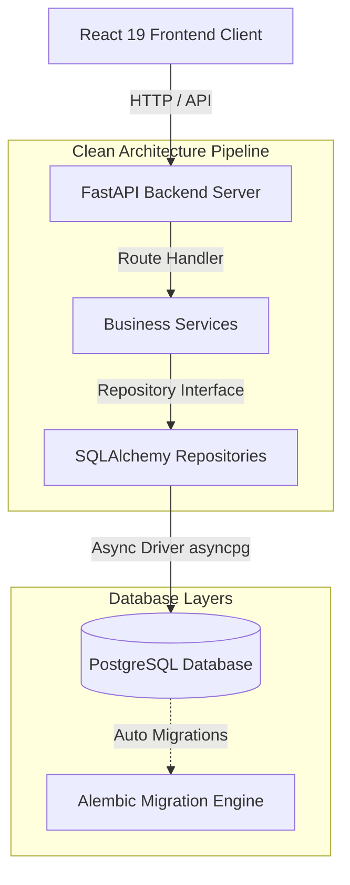

# Pramana — Regulatory Intelligence Platform
> Transforming Regulatory Knowledge into Trusted Action.

Pramana is an enterprise-grade AI-powered Regulatory Intelligence Platform. It ingests complex regulatory circulars (such as SEBI mandates) and constructs explainable, traceable digital twins linking legal obligations directly to verified internal control points, operations, and ledger audits.

---

## 🏛️ Architecture Overview

The system is engineered using a clean, decoupled monorepo approach with PostgreSQL, an asynchronous Python backend, and a responsive TypeScript Single Page Application.



### Decoupled Monorepo Structure

*   **Frontend**: Built with **React 19**, **Vite**, **TypeScript**, and **Tailwind CSS**. It follows a **Feature-First Architecture** where pages, sub-components, and state hooks are grouped together by feature domain (e.g., dashboard, digitalTwin, actionPlan, executive).
*   **Backend**: Built with **FastAPI** (Python 3.12+). It utilizes **Clean Architecture** patterns where API controllers rely on domain services, which talk to generic repositories to interact with declarative database models. Controllers never interface with the database engine directly.
*   **Database**: **PostgreSQL 16** managed via **SQLAlchemy 2.0 (Asyncio)**. Schema changes are tracked with auto-detected **Alembic** migrations.

---

## 📂 Project Directory Layout

```
pramana/
├── backend/
│   ├── app/
│   │   ├── api/             # API Routers & Route Controllers
│   │   ├── core/            # Config settings, Logging, Exception mappings
│   │   ├── database/        # Async connection session pooling
│   │   ├── middleware/      # Telemetry, latencies, and CORS policies
│   │   ├── models/          # SQLAlchemy Base & model mixins (UUID, Timestamps, Soft-Delete)
│   │   ├── repositories/    # Generic async CRUD operations
│   │   ├── services/        # Business logic processes (empty skeletons)
│   │   └── main.py          # FastAPI application entry point
│   ├── migrations/          # Alembic DB migration version control
│   ├── alembic.ini          # Migration config rules
│   ├── pyproject.toml       # Black format and Mypy compiler configurations
│   ├── requirements.txt     # Python production-ready dependency lock
│   └── Dockerfile           # Backend container environment
│
├── frontend/
│   ├── src/
│   │   ├── app/             # Global layout templates and Router mappings
│   │   ├── components/ui/   # Reusable UI library (buttons, tables, modals, loaders)
│   │   ├── features/        # Feature-First modules (Landing, Dashboard, twin, plan, council)
│   │   ├── shared/          # Axios wrappers, css tools, global TypeScript types
│   │   └── main.tsx         # React root bootstrapping script
│   ├── vite.config.ts       # Vite builder & Docker HMR watchers
│   ├── tsconfig.json        # Strict TypeScript rules
│   ├── tailwind.config.js   # Palantir/Linear customized styling configuration
│   └── Dockerfile           # Node/Vite development server container
│
├── docker-compose.yml       # Production-grade system orchestrator configuration
├── .env.example             # Environment template variables
└── README.md                # Platform documentation handbook
```

---

## ⚡ Tech Stack

| Component | Technology | Description |
| :--- | :--- | :--- |
| **Client** | React 19, TS, Vite | Modern rendering, fast development cycles, type safety. |
| **Styling** | Tailwind CSS v3 | Curated Deep Navy, Slate, and Emerald palette. |
| **Routing** | React Router v6 | Declarative layout nesting and routing. |
| **Queries** | TanStack Query v5 | Server state caching, retries, and request status tracking. |
| **Network** | Axios Client | Interceptor handlers mapping requests and centralizing exceptions. |
| **Canvas** | React Flow | Directed compliance lineage graph panels. |
| **Charts** | Recharts | Responsive SVG charts (Area and Bar visualizations). |
| **API Backend**| FastAPI, Uvicorn | High-performance, asynchronous HTTP serving. |
| **ORM** | SQLAlchemy 2.0 | Async pool execution using `asyncpg`. |
| **Migrations**| Alembic | Incremental database schema versioning. |
| **QA Tools** | Black, Isort, Mypy | Strict Python formatting, import ordering, and type check checks. |
| **Quality** | ESLint, Prettier | Uniform frontend coding style guide. |

---

## 🚀 Getting Started

### Prerequisites

*   Docker Desktop installed on your host machine.
*   Docker Compose v2+ CLI availability.

### Installation & Launch

1.  **Clone or Open the Workspace**:
    Make sure you are in the project root containing `docker-compose.yml`.

2.  **Initialize Environment Variables**:
    Create `.env` based on the template:
    ```bash
    cp .env.example .env
    ```

3.  **Boot the Services**:
    Build the backend, client, and postgres containers, then spin them up:
    ```bash
    docker compose up --build
    ```
    *This runs the database health checks, starts the FastAPI server on port 8000, and boots the Vite dev server on port 3000.*

---

## 🔍 Validation Endpoints

Once docker reports that containers are active, confirm system health using:

*   **Platform UI (Landing)**: [http://localhost:3000](http://localhost:3000)
*   **Platform Dashboard**: [http://localhost:3000/dashboard](http://localhost:3000/dashboard)
*   **Backend OpenAPI Swagger Docs**: [http://localhost:8000/docs](http://localhost:8000/docs)
*   **Database Connectivity Status**: [http://localhost:8000/api/v1/health](http://localhost:8000/api/v1/health) (Should return `{"status":"healthy","database":"healthy"}`)

---

## 🛠️ Formatting & Development Code Quality

Verify Python formatting and types inside the backend container or locally:
```bash
# Formatter check
black --check backend/app

# Import order check
isort --check-only backend/app

# Strict static type checker
mypy backend/app
```

Verify Frontend lint rules:
```bash
# Lint checks
cd frontend && npm run lint
```

---

## 💻 Frontend Workspace Architecture & Views (Phase 4C)

The Pramana frontend client is designed to deliver a high-fidelity, premium compliance auditing experience.

### 🌐 State & Session Workspace
*   **Global Context (`global-context.tsx`)**: Synchronizes workspace preferences (theme, sidebar collapse state) and the active SEBI regulation review ID (`activeSessionId`), persisting settings to browser `localStorage` across page refreshes.
*   **API Interceptor (`api.ts`)**: Centralized Axios handler converting server response statuses and catching connection failures.

### 🛣️ Complete Parameterized Routing
*   `/` - Landing Page: Visual presentation of the monorepo architecture and call-to-actions.
*   `/dashboard` - Compliance readiness stats, recent regulations list, active action items list, and responsive Recharts trends.
*   `/upload` - Drag-and-drop zone with animated parser metrics. Calls `/upload` and `/analyze` consecutively.
*   `/analysis/:id` - Detailed session view, showing regulatory timeline, metadata, LLM executive summaries, and obligations.
*   `/digital-twin/:id` - Dynamic React Flow canvas linking legal clauses to control points, with zoom/pan and detail inspect sidebar.
*   `/action-plan/:id` - Table / Kanban toggler for checklists, with status/priority filters, search, sorting, and drawer.
*   `/explainability/:id` - Collapsible lineage traces showing matching confidence and proof mappings.
*   `/settings` - Core preference selectors and backend health check diagnostics.
*   `/not-found` - Premium custom 404 clearance view.

---

## 🗄️ Demo Dataset & Seeder

Pramana includes a fully integrated SEBI compliance demo dataset. It populates:
- **Three realistic SEBI circulars**:
  1. *Client Fund Segregation and Escrow Audits* (`SEBI/HO/MIRSD/2026/12`) targeting `Demo Securities Ltd.`
  2. *Margin Intraday Leverage Capping and RMS Limits* (`SEBI/HO/MRD/2026/08`) targeting `Sample Broker Pvt Ltd.`
  3. *Cyber Security Incident and Threat Notification Protocol* (`SEBI/HO/ITD/2026/45`) targeting `Sample Asset Management Co.`
- **20 obligations** using realistic regulatory language.
- **40 execution blueprint tasks** mapped to 5 departments (*Treasury*, *IT*, *Compliance*, *Operations*, *Audit*) with due dates, dependencies, and evidence definitions.

**To seed or reset the database**:
- Click **"Reset & Load Demo Data"** on the Compliance Control Center or **"Load Demo Dataset"** in Platform Settings.
- Alternatively, make a POST request to:
  ```bash
  curl -X POST http://localhost:8000/api/v1/seed-demo
  ```

---

## 📊 Exporting Reports

Pramana generates styled, print-ready compliance packages directly in the browser:
- **Executive Summary PDF**: Contains boardroom synthesis and required remediations.
- **Compliance Audit Report PDF**: Full compliance posture overview table.
- **Execution Blueprint PDF**: Complete checklist of 40 control tasks, owners, and evidence requirements.
- **Decision Traceability PDF**: Complete linear lineage mapping clauses directly to AI reasoning pathways.

To export, click the corresponding **Print** or **Export** button inside the Analysis, Execution Blueprint, or Decision Traceability page. Save the output directly as a PDF from the print preview window.

---

## 🧪 Integration & E2E Testing

Verify the complete platform flow (health checks, seeding, dashboard calculations, digital twin topologies, and traceability metrics) using the ASGI integration test suite:

```bash
# Execute within the running docker container
docker compose exec -e PYTHONPATH=. backend pytest tests
```


# Pramana

